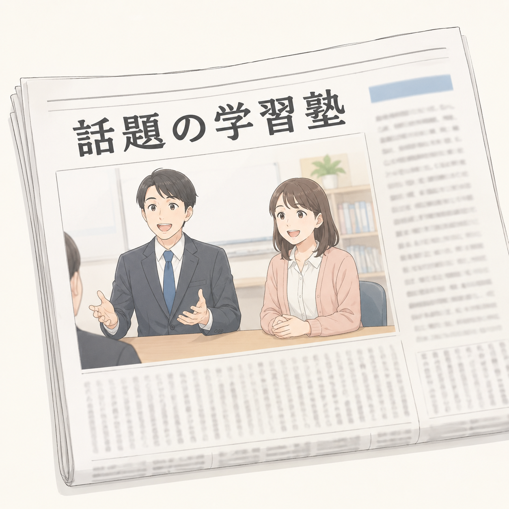
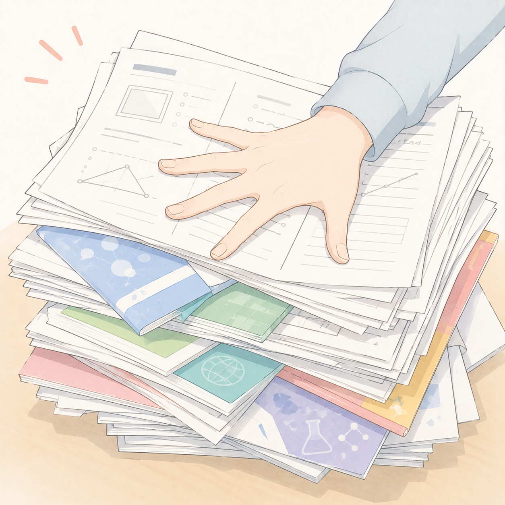

# 「カードで学習塾」イベントモード要件定義書

| 項目 | 内容 |
|---|---|
| 文書ID | CDG-EVENT-REQ-001 |
| 文書版 | 1.0 |
| 作成日 | 2026年8月14日 |
| 対象 | Webゲーム「カードで学習塾 春期講習編」 |
| 対象機能 | イベントモード、塾アイテム、イベントスコア |
| ステータス | 実装基準 |

## 1. 目的

期間限定のイベントと、イベント中だけ利用できる「塾アイテム」を追加する。通常のゲーム進行を維持しながら、イベント固有の効果、スコア計算、結果記録およびハイスコアを提供する。

本書は、イベントモードの画面、ゲーム進行、データ、保存・復元、スコアおよび受入条件を定義する。本文中の「する」「しなければならない」は必須要件を表す。

## 2. 適用範囲

### 2.1 対象

- タイトル画面でのイベント案内とイベントモード選択
- イベントおよび塾アイテムのデータ定義
- 塾アイテムの入手、所持、条件判定、効果発動、演出
- スケジュール画面での塾アイテム情報表示
- イベント専用スコア計算とハイスコア
- 結果画面およびスコア送信内容
- イベントゲームの中断保存と復元
- 最初に開催するイベントと3種類の塾アイテム

### 2.2 対象外

- イベント選択画面および過去イベントの任意選択
- ゲーム開始後のイベントモード切替
- 塾アイテムの破棄、売却、重複所持
- 開催情報をサーバーから動的に配信する管理画面
- 通常モードのスコア計算変更

## 3. 用語

| 用語 | 定義 |
|---|---|
| イベント定義 | イベントID、名称、開催期間、塾アイテムなどを保持する設定データ |
| 現在開催中のイベント | リリース時の設定で指定され、かつ現在日時が開催期間内にあるイベント |
| イベントモード | ゲーム開始時にプレイヤーが有効化するイベント適用状態 |
| 塾アイテム | カードとは別に所持し、指定条件で自動的に効果を発揮するイベント用アイテム |
| 使用 | 塾アイテムの効果解決を開始し、使用回数を消費すること。実際のパラメータ変化が0でも使用に含む |
| 発動予約 | 条件が成立した後、未来の指定タイミングで1回分の効果を解決するために予約レコードを保持すること。同一アイテムが複数の予約を保持できる |
| 所持カード枚数 | 山札、手札、スタッフ配置済みカードの合計枚数。塾アイテム、研修候補、削除済みカードは含まない |

## 4. イベントの管理

### 4.1 イベントレジストリ

1. イベントは、過去分を含むイベントレジストリで管理する。
2. 各イベントには、表示名とは別に変更されない一意の `eventId` を付与する。
3. リリースごとに設定値 `currentEventId` で現在のイベント候補を1件指定する。
4. タイトル画面にイベントを表示する条件は、次の両方を満たすこととする。
   - `currentEventId` に対応するイベント定義が存在する。
   - 現在の日本時間がイベントの開催期間内である。
5. 条件を満たすイベントがない場合、イベント案内とイベントトグルは表示しない。
6. 同時に開催できるイベントは1件とする。
7. 終了済みイベントの定義は、中断データ復元のため以後のリリースから削除しない。

### 4.2 開催日時

1. 開催日時の判定タイムゾーンは日本標準時（Asia/Tokyo）とする。
2. 終了日時は排他的境界とする。終了日時に到達した時点で新規ゲームには表示しない。
3. 最初のイベントの開始日時は、そのイベントを含むリリースの公開日時とする。
4. 「2026年9月23日24時まで」は、`2026-09-24T00:00:00+09:00` 未満と解釈する。
5. ゲーム開始後に開催期間が終了しても、開始済みのゲームには影響を与えない。

### 4.3 難易度および計算機モードとの関係

1. イベントモードはFRESH、PROの両難易度で利用できる。
2. イベントモードは計算機モードと併用できる。
3. ゲーム開始時に、難易度、計算機モード、イベントモードおよび `eventId` をゲーム状態へ固定する。
4. ゲーム開始後は、これらの値を変更できない。
5. 計算機モードでも、アイテム入手、判定、発動、使用回数およびスコア計算はイベントモードの規則を適用する。
6. カード獲得効果の入力方法は、通常モードでは既存の研修選択UI、計算機モードでは既存の計算機モード用研修入力UIを使用する。

## 5. タイトル画面

### 5.1 イベント案内

1. 現在開催中のイベントがある場合、タイトル画面に次を表示する。
   - イベント名
   - 開催終了日時
   - イベントモードのトグル
   - 折りたたみ可能なイベント詳細
2. イベント詳細には、選択中の難易度で獲得可能な全塾アイテムについて、名称、入手時期および説明文を表示する。
3. イベント詳細は初期状態で折りたたむ。
4. 詳細の開閉操作は、イベントモードがOFFでも利用できる。

### 5.2 イベントトグル

1. 初期値はOFFとする。
2. プレイヤーが最後に選択した値をブラウザへ保存し、次回のタイトル表示時に復元する。
3. 保存値はタイトル画面の選択値であり、開始済みゲームの状態を書き換えてはならない。
4. 現在開催中のイベントがない場合、保存値がONでもイベントモードを開始してはならない。
5. 中断データを復元する場合、タイトル画面の保存値ではなく中断データ内のイベント状態を優先する。

## 6. イベントおよび塾アイテムのデータ要件

### 6.1 イベント定義の必須項目

| 項目 | 内容 |
|---|---|
| `eventId` | 保存・ハイスコア識別に使う一意かつ不変のID |
| `name` | 画面表示およびスコア送信に使うイベント名 |
| `startsAt` | 開催開始日時。日本時間のオフセットを含む |
| `endsAt` | 開催終了日時。日本時間のオフセットを含む |
| `items` | アイテムIDを発動・入手順に並べた配列 |

### 6.2 塾アイテム定義の必須項目

| 項目 | 内容 |
|---|---|
| `itemId` | イベント内で一意かつ不変のID |
| `name` | 表示名 |
| `image` | 正方形画像へのパス |
| `difficulties` | `fresh`、`pro`、または両方 |
| `acquisitionTiming` | 入手時期 |
| `judgmentTiming` | 条件を判定する時期 |
| `condition` | 発動条件 |
| `activationTiming` | 効果を解決する時期。省略時は判定時期と同一 |
| `effect` | 発動時の効果 |
| `limitType` | `turn` または `game` |
| `limitCount` | 制限期間内の最大使用回数 |
| `description` | プレイヤーに表示する完全な効果説明 |

### 6.3 難易度指定

1. アイテム名先頭の `[FRESH]` または `[PRO]` は、データ投入時の難易度指定として使用できる。
2. `[FRESH]` のアイテムはFRESHだけ、`[PRO]` のアイテムはPROだけで入手できる。
3. 接頭辞がないアイテムは両難易度で入手できる。
4. 接頭辞はプレイヤー向けのアイテム名には表示しない。
5. 実行時は文字列解析に依存せず、正規化された `difficulties` を使用して判定する。

### 6.4 実行状態

アイテムごとに、少なくとも次の状態を保持する。

| 項目 | 内容 |
|---|---|
| `acquired` | 入手済みか |
| `acquiredTurn` | 入手ターン |
| `acquisitionOrder` | 同時処理時の入手順 |
| `usageTotal` | ゲーム中の累計使用回数 |
| `usageThisTurn` | 現在ターンに実際に解決した効果の回数 |
| `triggerCountThisTurn` | 現在ターンに条件成立から生成した発動予約の回数。ターン単位の回数制限判定に使用する |
| `conditionState` | 継続保持が必要なアイテム固有の条件状態 |
| `activationReservations` | 未来の効果の予約と解決履歴を保持する予約レコードの配列 |
| `resolvedActivationCount` | 予約から解決済みとなった効果の累計回数 |

各発動予約レコードは、少なくとも一意の予約ID、条件成立ターン、作成順、発動予定タイミングおよび `pending`・`resolving`・`resolved` の状態を持つ。

## 7. 塾アイテム共通仕様

### 7.1 所持

1. 同一ゲーム内で同じ塾アイテムを複数個入手しない。
2. 入手済みアイテムは破棄できない。
3. 塾アイテムはカードとして扱わない。
4. 塾アイテムは山札、手札、スタッフ配置、研修プール、削除対象および所持カード枚数に含めない。

### 7.2 入手タイミング

1. 「ゲーム開始時」は、基本カードの初期化後、既存の初回研修より前とする。
2. 「○月○旬ターン開始時」は、そのターンの概要表示および研修カード選択より前とする。
3. 同じタイミングで複数アイテムを入手する場合、イベント定義の `items` 順に入手する。
4. アイテムを入手するたびに、保存状態を更新する。

### 7.3 条件判定

1. 入手済みかつ回数上限に達していないアイテムだけを判定対象とする。
2. 条件を満たさなかった場合、次の同一判定タイミングで再判定する。
3. 条件を満たした場合、プレイヤーの確認なしで自動発動または発動予約する。
4. 同じタイミングで複数アイテムを処理する場合、`acquisitionOrder` の昇順で処理する。
5. カードカテゴリの「使用枚数」は、当該ターンにカード効果が有効として解決されたカードを数える。
6. コスト不足、職種制限その他の理由でカード効果が無効になったカードは使用枚数に含めない。
7. おすすめ行動ボーナスの有無は使用枚数に影響しない。
8. PROの「並行」による重ね配置を含め、有効に解決された全配置カードを数える。
9. 即時発動型の回数制限は効果の使用回数で判定し、発動予約型のターン単位の回数制限は当該ターンの予約生成回数で判定する。

### 7.4 効果解決と回数消費

1. 効果の解決開始時に使用回数を消費する。
2. 入塾が体験を超えられないなどの既存上限により実際の変化量が0でも、使用回数を消費する。
3. パラメータ変更には既存の境界規則を適用する。
4. `limitType: turn` の `usageThisTurn` と `triggerCountThisTurn` は各ターン開始時に0へ戻す。
5. `limitType: game` の `usageTotal` はゲーム終了まで戻さない。
6. 発動予約型のアイテムでは、ターン単位の回数制限を「そのターンに生成できる予約数」に適用する。条件成立時に `triggerCountThisTurn` を増やし、1回分の予約レコードを追加する。
7. 発動予約を追加した時点では `usageTotal` と `usageThisTurn` を増やさない。予約した効果の解決開始時に、両方を1回分増やす。
8. 異なるターンに生成された複数の予約は同時に保持できる。
9. 発動予定ターンに複数の予約を解決することは、予約を生成した各ターンで回数制限を満たしている限り、`ターン中1回` の違反とはしない。
10. 効果解決または予約状態変更の直前および直後に保存可能な状態を確定し、再読み込みによる予約消失・二重発動を防ぐ。

### 7.5 処理順

ターン開始時の基本順序は次のとおりとする。

1. ターン番号およびターン設定を確定する。
2. `usageThisTurn` と `triggerCountThisTurn` をリセットする。
3. 当該ターン開始時に入手するアイテムを付与し、入手演出を行う。
4. 「ターン開始後」を判定時期とするアイテムを判定・解決する。
5. ターン概要を表示する。
6. 通常の研修フェーズへ進む。

教室行動フェーズ終了時の基本順序は次のとおりとする。

1. 室長に配置したカードを配置順に解決する。
2. 講師に配置したカードを配置順に解決する。
3. 事務に配置したカードを配置順に解決する。
4. 当該ターンの有効なカード使用枚数を確定する。
5. アイテムを入手順に判定し、即時発動または1回分の発動予約を生成する。
6. 当該タイミングで解決すべき即時効果と予約済み効果を確定する。
7. アイテムの入手順に効果を解決する。同一アイテムに複数の予約がある場合は、予約の作成順に1回ずつ解決する。
8. 各予約を解決するたびに予約状態、使用回数、パラメータおよび演出を更新する。
9. 教室行動フェーズを終了する。

## 8. 画面および演出

### 8.1 入手演出

1. アイテム入手時は全画面の専用演出を表示する。
2. 演出には画像、アイテム名、入手時期および説明文を表示する。
3. 1アイテムにつき1画面とし、プレイヤーがタップまたはクリックすると次へ進む。
4. 複数入手時は入手順に連続表示する。
5. 最後の入手演出を閉じた後、元のゲーム進行へ戻る。

### 8.2 効果発動演出

1. 既存フェーズのアクションに対応する効果は、既存の演出とUIを流用する。
2. 教室行動フェーズ終了時に発動するアイテムは、室長、講師、事務のカード効果演出に続けて表示する。
3. アイテム効果画面にはアイテム画像、名称、説明文および発生した変化量を表示する。
4. パラメータ変更時は既存のパラメータ上昇・下降アニメーションを行う。
5. カード選択取得効果は既存の研修フェーズと同じカード表示・選択体裁を使う。
6. 通常モードの必須取得効果には「取得しない」を表示しない。

### 8.3 スケジュール画面

1. イベントモード中は、スケジュール画面に「塾アイテム」セクションを追加する。
2. 選択中の難易度で登場する全アイテムを、未入手分も含めて入手順に表示する。
3. 各アイテムに、正方形画像、名称、入手時期、説明文および現在状態を表示する。
4. 画像はカードイラストと同じ表示寸法・縮尺規則で扱い、縦横比を変形させない。
5. 状態表示は次を基本とする。

| 状態 | 表示文言 |
|---|---|
| 未入手 | `未入手` |
| ターン制限・当該ターン未使用 | `今ターン未使用` |
| ターン制限・当該ターン使用済み | `今ターンn回使用済み` |
| ゲーム制限・未使用 | `未使用` |
| ゲーム制限・使用済み | `n回使用済み` |
| 未来の効果を1回以上予約済み | `発動予約済み（n回）` |

## 9. 最初に開催するイベント

### 9.1 イベント定義

| 項目 | 値 |
|---|---|
| `eventId` | `summer-cup-2026-post-obon` |
| イベント名 | お盆明け、講習の前に講習！26夏期杯 |
| 開始 | 当該イベントを含むリリースの公開日時 |
| 終了 | 2026年9月24日 0時00分（日本時間、同時刻を含まない） |
| 対象難易度 | FRESH、PRO |
| アイテム順 | 新聞取材 → アイデアの化学反応 → 春休みの宿題 |

### 9.2 新聞取材



| 要素 | 内容 |
|---|---|
| `itemId` | `press-coverage` |
| 対象難易度 | FRESH、PRO |
| 入手時期 | ゲーム開始時 |
| 判定時期 | アクションカードの効果解決後 |
| 発動条件 | 当該ターンに動員カテゴリカードを3枚以上使用している |
| 発動タイミング | 教室行動フェーズ終了時 |
| 効果 | 体験+2 |
| 回数制限 | ターン中1回 |
| 表示説明 | アクションカード配置後、このターンに動員カテゴリカードを3枚以上使用している場合、教室行動フェーズ終了時に、体験+2［ターン中1回］ |

追加規則:

1. 毎ターン判定し、条件を満たした各ターンに1回発動する。
2. 条件を満たさないターンは使用回数を消費しない。
3. 教室行動フェーズ終了時の順序は「室長→講師→事務→新聞取材」とする。ただし同時点に他のアイテムも発動する場合は入手順を適用する。

### 9.3 アイデアの化学反応


| 要素 | 内容 |
|---|---|
| `itemId` | `idea-chemistry` |
| 対象難易度 | FRESH、PRO |
| 入手時期 | ゲーム開始時 |
| 判定時期 | 各ターン開始後、研修前 |
| 発動条件 | 所持カード枚数が10枚以上 |
| 発動タイミング | 判定直後 |
| 効果 | 選択中の難易度のSSRカード3枚から1枚を選択して獲得 |
| 回数制限 | ゲーム中1回 |
| 表示説明 | ターン開始後、所持カード枚数が10枚以上の場合、ランダムなSSRカード3枚のうち1枚を選択して獲得［ゲーム中1回］ |

追加規則:

1. 条件未達の場合、次のターン開始時に再判定する。
2. 所持カード枚数は山札、手札、スタッフ配置済みカードの合計とする。
3. 塾アイテム、研修候補、削除済みカードは枚数に含めない。
4. 通常モードでは、選択中の難易度のSSR研修プールから異なるカード名を3枚提示する。
5. 提示およびプール消費は通常の研修と同じ規則を使う。
6. プレイヤーは必ず1枚を選択し、「取得しない」は選べない。
7. 計算機モードでは、既存の計算機モード用研修入力UIで、選択中の難易度のSSRカードを1枚入力して獲得する。
8. 通常のプール再構成後も異なるSSRカードを3枚用意できない場合はデータエラーとし、効果を未使用のまま保つ。プレイヤーに取得失敗を通知し、ログへ記録する。
9. 選択したカードの獲得が確定した時点で1回使用済みとする。
10. 効果の処理終了後に、そのターン本来の研修へ進む。

### 9.4 春休みの宿題



| 要素 | 内容 |
|---|---|
| `itemId` | `spring-homework` |
| 対象難易度 | FRESH、PRO |
| 入手時期 | 3月下旬ターン開始時、研修前 |
| 判定時期 | アクションカードの効果解決後 |
| 発動条件 | 当該ターンに教務カテゴリカードを3枚以上使用している |
| 発動タイミング | 最終ターンの教室行動フェーズ終了時 |
| 効果 | 入塾+3 |
| 回数制限 | ターン中1回 |
| 表示説明 | アクションカード配置後、このターンに教務カテゴリカードを3枚以上使用している場合、最終ターンの教室行動フェーズ終了時、入塾+3［ターン中1回］ |

追加規則:

1. 3月下旬以降、ゲーム終了まで各教室行動フェーズで条件を判定する。
2. 条件を満たしたターンごとに、1回分の発動予約を `activationReservations` へ追加する。同一ターンに追加できる予約は1回までとする。
3. 予約を追加した後も、次ターン以降は同じ条件を再判定し、新たに条件を満たすたびに予約を追加する。
4. 最終ターンより前に作成したすべての予約は、最終ターンの教室行動フェーズ終了時まで保持する。
5. 最終ターン自身でも条件を判定し、条件を満たした場合は、既存予約の解決前に最終ターン分の予約を1回追加する。
6. 最終ターンの教室行動フェーズ終了時に、保持している未解決予約を作成順にすべて解決する。予約1件につき、入塾+3を1回適用し、1回使用済みとして記録する。
7. 条件を満たしたターン数が発動回数となり、ゲーム中の固定上限は設けない。ただし各ターンの予約生成は1回までとする。
8. 複数回分をまとめて1回の効果に集約せず、予約件数と同じ回数だけ効果解決、使用回数加算および効果演出を行う。
9. 最終ターンの発動順では、同時に発動する入手済みアイテムの入手順に従い、「春休みの宿題」の複数予約はその中で作成順に解決する。
10. 入塾上限により各回の実増加量が3未満または0でも、その予約を解決済みにして1回使用済みとする。

動作例:

- 3月下旬、4月上旬、4月下旬の3ターンで条件を満たし、最終ターンでは満たさなかった場合、予約は3件となり、最終ターンに入塾+3を3回解決する。
- 上記に加えて最終ターンでも条件を満たした場合、最終ターン分を加えた4件を解決する。

## 10. イベントスコア

### 10.1 共通

1. イベントモードのときだけ本章の計算式を適用する。
2. 通常モードの計算式は変更しない。
3. 記号を次のとおり定義する。

| 記号 | 内容 |
|---|---|
| `E` | 体験 |
| `N` | 入塾 |
| `S` | 満足 |
| `A` | 経理 |
| `W` | 退塾数 |
| `D` | 入退差 |

```text
W = max(15 - A, 0) + max(15 - S, 0)
D = N - W
round1(v) = round(v × 10) ÷ 10
```

4. 項目別の途中値は丸めず、最終結果だけを小数第1位へ四捨五入する。

### 10.2 FRESH

現行の退塾、動員、入退差ポイントを合計した基礎ポイントを `P` とする。

| 観点 | 条件 | 得点 |
|---|---:|---:|
| 退塾 | `W = 0～1` | +1 |
| 退塾 | `W = 2～3` | 0 |
| 退塾 | `W >= 4` | -3 |
| 動員 | `E = 0～9` | 0 |
| 動員 | `E = 10～11` | +1 |
| 動員 | `E >= 12` | +2 |
| 入退差 | `D <= 7` | 0 |
| 入退差 | `D = 8～9` | +3 |
| 入退差 | `D = 10～11` | +4 |
| 入退差 | `D >= 12` | +5 |

`P` が8でない場合は `displayScore = P` とする。`P = 8` の場合だけ次を適用する。

```text
freshRawScore =
    8
    + 0.5 × (min(E, 30) - 12) ÷ 18
    + 1.5 × (min(D, 30) - 12) ÷ 18
    + max(E - 30, 0) ÷ 72
    + max(D - 30, 0) ÷ 24

displayScore = round1(freshRawScore)
points = P
```

追加要件:

- `points` の最大値は従来どおり8とする。
- ランク判定は従来どおり `displayScore >= 9.0` をS+とする。
- 10点を超えてもランクはS+のまま、数値スコアだけを上昇させる。
- 体験および入退差が30以下の範囲では現行結果と一致させる。

### 10.3 PRO

現行CSVのカテゴリ得点を合計した値を `P0` とする。

```text
experienceOverflow     = max(E - 50, 0) ÷ 10
enrollmentDiffOverflow = max(D - 48, 0) ÷ 8
satisfactionOverflow   = max(S - 35, 0) ÷ 10

proRawScore =
    P0
    + experienceOverflow
    + enrollmentDiffOverflow
    + satisfactionOverflow

points = round1(proRawScore)
displayScore = points
```

追加要件:

- 退塾には上限超過加点を設けない。
- 経理15超の値には直接加点しない。
- 現行のランク基準を変更しない。
- 16点を超えても最高ランクのまま、数値スコアだけを上昇させる。
- `E <= 50`、`D <= 48`、`S <= 35` の範囲では現行結果と一致させる。

### 10.4 表示

1. スケジュール画面のスコア換算表に、イベント時の上限超過加点を説明する。
2. 結果画面の内訳に、基礎得点と上限超過分を分けて表示する。
3. FRESHでは精度スコアの内訳、PROでは各カテゴリの上限超過分を表示する。
4. 「FRESH最大10.0点」「PRO最大16点」と断定する既存表記を、上限開放後の仕様に合わせて修正する。

## 11. 結果画面、送信およびハイスコア

### 11.1 結果画面

1. イベントモードでは、ビルド情報を `バージョン / イベント名 / ユーザーID` の順で表示する。
2. 画面幅により改行する場合、3要素の間でだけ改行できる。
3. バージョン、イベント名、ユーザーIDの各要素途中では改行しない。
4. 通常モードの表示は変更しない。

### 11.2 スコア送信

1. イベントモードでは、送信データの `mode` を次の形式とする。

| 状態 | `mode` |
|---|---|
| イベントのみ | `イベント:(イベント名)` |
| イベント＋計算機 | `イベント:(イベント名)/計算機` |

2. `(イベント名)` はゲーム開始時に固定したイベント名で置換する。
3. `difficulty` は従来どおり別項目で送信する。
4. 通常モードは従来の `通常`、計算機モードは従来の `計算機` を維持する。
5. GAS側の `displayScore` と `points` の受入上限を100へ変更する。
6. スコアが小数の場合も欠落または整数化せず送信する。

### 11.3 ハイスコア

1. イベントのハイスコアは `difficulty × eventId` ごとに分離する。
2. イベントのハイスコアは通常モードのハイスコアへ反映しない。
3. 異なるイベント間でハイスコアを共有しない。
4. 計算機モード併用時は、同じ `difficulty × eventId` のハイスコア枠を使用する。これは既存の計算機モードの扱いを維持するためである。
5. FRESHは `displayScore`、PROも拡張後の `displayScore` で比較する。

## 12. 保存と復元

### 12.1 保存対象

イベントゲームでは、既存の保存項目に加えて次を保存する。

- イベントモードの有効状態
- `eventId`
- ゲーム開始時点のイベント名
- アイテムごとの実行状態一式
- アイテム効果で提示中のカード候補と選択状態
- アイテム入手演出または発動演出の進行位置
- 発動予約レコードの配列、各予約の処理状態および解決済み件数
- 最後に保存した日時

### 12.2 保存タイミング

少なくとも次の直後に保存する。

- ゲーム開始時のイベント状態確定
- アイテム入手
- 入手演出の各画面完了
- 条件成立および発動予約レコード追加
- 各発動予約の解決開始・解決完了
- 効果の使用回数消費
- カード候補抽選
- カード獲得確定
- ターン開始時の使用回数リセット
- 既存の研修、行動、会議フェーズの保存時点

### 12.3 期間終了後の復元

1. イベント期間終了後も、開始済みの中断データは保存されている `eventId` の内容で再開する。
2. 現在開催中のイベントやタイトル画面のトグル値へ置き換えない。
3. 開催期間終了の判定と、ビルドバージョン不一致の判定は独立して扱う。
4. ビルドバージョンが保存時と一致している場合、イベント期間が終了していることだけを理由に中断データを削除してはならない。
5. ビルドバージョンが保存時と一致しない場合は、イベント期間内外にかかわらず、既存仕様どおり中断データをリセットする。
6. 過去イベントの定義を以後のリリースにも残す要件は維持するが、ビルドバージョン不一致時の既存リセット仕様は変更しない。

### 12.4 イベント定義欠落時

1. 先に既存のビルドバージョン一致判定を行う。バージョン不一致の場合は、12.3のとおり既存のリセット処理を行う。
2. ビルドバージョンが一致しており、中断データの `eventId` に対応するイベント定義が存在しない場合、ゲームを復元せず、保存データも自動削除しない。
3. 操作を遮断するエラー画面を表示する。
4. 中断日時は保存データの `savedAt` を日本時間へ変換して表示する。
5. 表示文は次のとおりとする。

> イベント開催期間終了（または、開発者のミス！）のため、一部の情報が読み込めませんでした。不具合と思われる場合は、画面はこのままにして、開発者にご相談ください。  
> イベントモードで前回遊んだ情報をリセットして、新たに始める場合は、下のボタンを押してください。  
> 中断日時: （最後に中断データを保存した日時・日本時間）

6. エラー画面に `[新しくゲームを始める]` ボタンを表示する。
7. ボタンを押すまでは画面と保存データを維持する。
8. ボタン押下時は確認後に中断データだけを削除し、タイトル画面へ戻す。

## 13. ログおよび障害時動作

次を既存ログへ記録する。

- イベントモードの開始、イベントID、イベント名、難易度、計算機モード
- アイテム入手
- 条件判定結果
- 有効カードのカテゴリ別使用枚数
- 発動予約の追加、予約ID、条件成立ターン、未解決予約件数
- 予約ごとの効果発動、実変化量、使用回数および解決状態
- カード候補の抽選と取得結果
- イベント定義または画像の読み込み失敗
- 中断データの読み込みと復元結果

画像の読み込みに失敗した場合もゲーム進行を停止せず、代替表示で名称と説明文を読めるようにする。ただしイベント定義自体が欠落した中断復元は、12.4のとおり停止する。

## 14. 非機能要件

1. 既存のスマートフォン縦画面で横スクロールを発生させない。
2. 画像にはアイテム名を代替テキストとして設定する。
3. トグル、折りたたみ、アイテム選択、演出送りはキーボードでも操作できる。
4. 色だけに依存せず、文字で未入手・未使用・使用済み・予約済みを識別できるようにする。
5. アイテム画像は正方形を維持し、`object-fit` 相当の処理で変形を防ぐ。
6. 既存のFRESH、PRO、通常モード、計算機モードおよび中断再開を壊さない。
7. アイテム判定と効果処理は、同一保存状態から複数回復元しても結果が重複しないこと。

## 15. 画像アセット

提供画像はすべて1254×1254ピクセルの正方形PNGである。

| アイテム | ファイル |
|---|---|
| 新聞取材 | `docs/assets/event-mode/新聞取材.png` |
| アイデアの化学反応 | `docs/assets/event-mode/アイデアの化学反応.png` |
| 春休みの宿題 | `docs/assets/event-mode/春休みの宿題.png` |

実装時は配信対象ディレクトリへ配置し、イベント定義から参照する。文書内の画像は確認用の原本として扱う。

## 16. 受入条件

### 16.1 イベント表示と開始

- [ ] 開催期間内はタイトル画面にイベント名、折りたたみ詳細、OFF初期値のトグルが表示される。
- [ ] トグル選択がブラウザに保存され、次回表示時に復元される。
- [ ] 開催期間外はトグルが表示されず、保存値がONでもイベントが開始しない。
- [ ] FRESH、PRO、イベント＋計算機の各組合せで開始できる。
- [ ] 開始後にイベント状態を変更できない。

### 16.2 アイテム

- [ ] 新聞取材とアイデアの化学反応を、初回研修より前に順番どおり入手する。
- [ ] 春休みの宿題を、3月下旬の研修より前に入手する。
- [ ] 入手ごとに画像付き全画面演出が表示され、1件ずつ操作して進められる。
- [ ] スケジュール画面に未入手を含む3アイテムと正しい状態が表示される。
- [ ] 塾アイテムが所持カード枚数、山札、手札、配置および削除対象に含まれない。

### 16.3 新聞取材

- [ ] 動員カードの有効解決が2枚以下なら発動しない。
- [ ] 有効解決が3枚以上ならカード効果後に体験+2が1回発動する。
- [ ] 無効カードは枚数に含まれず、PROの並行カードは有効なら枚数に含まれる。
- [ ] 同じターンに2回発動せず、次ターンには再度発動できる。

### 16.4 アイデアの化学反応

- [ ] 各ターンの研修前に所持カード10枚の条件を判定する。
- [ ] 条件未達なら次ターンに再判定する。
- [ ] 条件成立時、現在の難易度の異なるSSRカード3枚から必ず1枚を取得する。
- [ ] 取得後はゲーム中に再発動しない。
- [ ] 取得効果終了後、そのターン本来の研修が開始する。

### 16.5 春休みの宿題

- [ ] 3月下旬以降、教務カード3枚以上を有効解決した各ターンに発動予約が1件追加される。
- [ ] 同一ターンには発動予約が2件以上追加されない。
- [ ] 予約済みでも次ターンに条件を再判定し、再び条件成立すれば予約件数が増える。
- [ ] 複数の予約と各予約の状態が、ターンおよび再読み込みをまたいで保持される。
- [ ] 最終ターン自身の条件判定後、未解決予約が作成順にすべて解決される。
- [ ] 予約1件ごとに入塾+3、使用回数加算および効果演出が1回ずつ行われる。
- [ ] 最終ターンに初めて条件成立した場合も、同じ終了処理内で1回発動する。
- [ ] 各回で入塾の実増加が0でも、その予約は解決済み・使用済みになる。

### 16.6 スコアと記録

- [ ] イベント中だけ拡張スコア式が適用される。
- [ ] FRESHは現行上限内、PROは現行カテゴリ上限内で既存結果と一致する。
- [ ] 結果画面に `バージョン / イベント名 / ユーザーID` が表示される。
- [ ] 送信 `mode` がイベント単独・計算機併用で指定書式になる。
- [ ] 100以下の小数スコアをGAS側が受理する。
- [ ] ハイスコアが難易度およびイベントごとに分離される。

### 16.7 保存と復元

- [ ] 各アイテム状態を保存し、どの保存地点から復元しても二重入手・二重発動しない。
- [ ] ビルドバージョンが同じであれば、イベント終了後も同じイベント定義で中断ゲームを再開できる。
- [ ] ビルドバージョンが異なる場合は、イベント期間内外にかかわらず既存仕様どおり中断データがリセットされる。
- [ ] イベント定義欠落時は指定メッセージと中断日時を表示し、自動削除しない。
- [ ] `[新しくゲームを始める]` の確認後だけ中断データを削除できる。

## 17. 参照元

- 回答追記済み下書き: `CdG-EventMode-Spec.md`
- スコア仕様原案: `score-cap-extension-spec.md`
- 提供画像: 新聞取材、アイデアの化学反応、春休みの宿題
